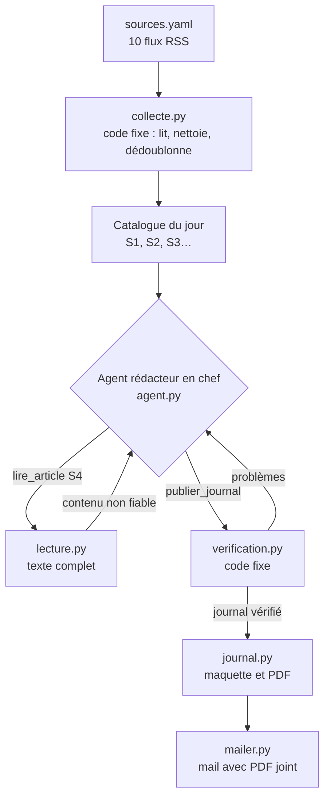

# Le Veilleur

Un agent IA qui lit chaque matin une dizaine de sources cyber et m'envoie un journal en PDF : un article de une développé, des brèves classées par rubrique et une notion à apprendre. Chaque information renvoie à sa source, et c'est du code, pas le modèle, qui le vérifie.

Le projet a deux objectifs. Me former au quotidien sur l'actualité technique, les fuites, la géopolitique et la régulation. Et montrer comment on construit un agent LLM qui reste fiable et sûr.

## Ce qu'est un agent, ici

Un LLM seul reçoit du texte et rend du texte. Un agent, c'est le même modèle placé dans une boucle avec des outils : il demande à utiliser un outil, le code l'exécute et lui renvoie le résultat, et il décide de la suite.

Le Veilleur ne donne de l'autonomie qu'à l'étape qui demande du jugement. La collecte est du code fixe. La rédaction est un agent, le rédacteur en chef. La vérification est du code fixe.

## Architecture



L'agent dispose de deux outils. `lire_article` lui donne le texte complet d'un article du catalogue. `publier_journal` lui sert à rendre le journal. Si la vérification échoue, l'outil lui renvoie la liste des problèmes et il peut corriger, deux fois au plus. Après, on ne garde que ce qui a passé le contrôle.

## Comment l'agent évite d'inventer

L'agent ne cite les sources que par identifiant, comme `S4`. Les liens sont ajoutés par le code à partir du flux, donc un lien inventé est impossible.

Avant publication, le code vérifie que chaque identifiant cité existe, que la une s'appuie sur au moins un article lu en entier et que chaque paragraphe de la une cite une source. Il vérifie aussi que chaque numéro de CVE et chaque grand nombre figurent dans les sources citées. Un « 4 500 000 victimes » absent de l'article est rejeté.

## Sécurité de l'agent

Le contenu des flux et des pages est traité comme une entrée non fiable, car n'importe qui peut écrire dans un article.

L'agent ne choisit jamais une URL. Il choisit un identifiant du catalogue, et le code visite le lien correspondant. Une page piégée ne peut donc pas le faire naviguer ailleurs. Le texte lu lui est rendu dans une balise `<contenu_non_fiable>`, et le prompt système précise que ce contenu n'est jamais une consigne.

Ses capacités sont bornées : deux outils, six lectures, dix tours, et une publication forcée au dernier tour. Les téléchargements ont un délai et une taille maximale. Le HTML est échappé avant la mise en page, les liens non `http` sont rejetés dès la collecte, et les secrets restent dans `.env`.

Chaque décision de l'agent est enregistrée dans `logs/trace-AAAA-MM-JJ.json` pour pouvoir relire son raisonnement.

## Installation

```bash
python -m venv .venv
source .venv/bin/activate          # sous Windows : .venv\Scripts\activate
pip install -r requirements.txt
playwright install chromium        # moteur utilisé pour produire le PDF
cp .env.example .env               # puis remplir la clé API et le compte mail
```

Pour Gmail, il faut un mot de passe d'application, le mot de passe du compte est refusé.

## Utilisation

```bash
python -m veille.main --dry-run    # produit le PDF dans out/ sans l'envoyer
python -m veille.main              # envoie le journal par mail
python -m pytest                   # 21 tests, sans réseau ni clé API
```

Pour ajouter une source, il suffit d'une entrée dans `sources.yaml`. Une source en panne est ignorée et signalée en bas du journal.

## Feuille de route

- [x] Récap sourcé et vérifié d'une source, envoi par mail
- [x] Agent rédacteur en chef, dix sources, journal PDF
- [ ] Mémoire SQLite des articles déjà traités et des notions déjà vues
- [ ] Notions sourcées par RAG sur les guides de l'ANSSI, progression de difficulté
- [ ] Retour sur la notion du jour et quiz du lendemain
- [ ] Exécution planifiée chaque matin

Les choix techniques et leurs alternatives sont détaillés dans [DECISIONS.md](DECISIONS.md).
