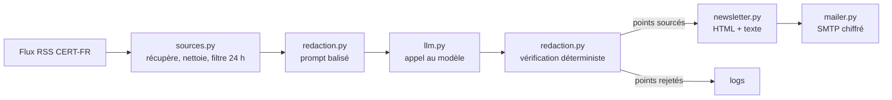

# Veille cyber

Un agent qui lit chaque matin des sources cyber choisies à l'avance et m'envoie une newsletter courte : les points qui comptent, un lien vers chaque source et une notion à apprendre.

Le projet a deux objectifs. Me former au quotidien, et montrer comment on construit un agent LLM qui reste fiable : il n'écrit que ce qu'il peut sourcer, et c'est du code, pas le modèle, qui le vérifie.

## Architecture



Le pipeline est linéaire : récupérer, rédiger, vérifier, envoyer. Chaque étape est un module qui fait une seule chose.

## Comment l'agent évite d'inventer

Le modèle reçoit uniquement le texte des articles du jour, chacun avec un identifiant court comme `A1`. Il doit rattacher chaque point à un identifiant.

Après sa réponse, le code vérifie trois choses. L'identifiant cité doit exister. Chaque numéro de CVE mentionné doit figurer dans l'article cité. Les liens ne viennent jamais du modèle : ils sont repris du flux à partir de l'identifiant, donc un lien inventé est impossible.

Un point qui échoue est retiré et journalisé. La newsletter indique combien de points ont été écartés.

## Sécurité

Le contenu des flux est traité comme une entrée non fiable.

Contre l'injection de prompt, les articles sont encadrés par des balises `<article>` et le prompt système précise que leur contenu est une donnée, jamais une consigne. L'agent n'a aucun outil à sa disposition : même une injection réussie ne pourrait que modifier le texte, et ce texte passe ensuite par la vérification.

Côté mail, le HTML est échappé automatiquement par Jinja2, et les liens non `http` sont rejetés dès la lecture du flux. Les secrets restent dans `.env`, exclu du dépôt. L'envoi passe par SMTP sur TLS.

## Installation

```bash
python -m venv .venv
source .venv/bin/activate
pip install -r requirements.txt
cp .env.example .env    # puis remplir la clé API et le compte SMTP
```

Pour Gmail, il faut un mot de passe d'application, le mot de passe du compte est refusé.

## Utilisation

```bash
python -m veille.main --dry-run    # écrit la newsletter dans out/ sans l'envoyer
python -m veille.main              # envoie la newsletter
python -m pytest                   # lance les tests
```

L'option `--feed` accepte un fichier local, utile pour tester sans réseau :
`python -m veille.main --dry-run --feed tests/fixtures/flux_test.xml --window 9999`

## Feuille de route

- [x] Étape 1 : une source, un récap sourcé et vérifié, envoi par mail
- [ ] Étape 2 : mémoire SQLite des articles déjà traités et des notions déjà vues
- [ ] Étape 3 : notions sourcées par RAG sur les guides de l'ANSSI, progression de difficulté
- [ ] Étape 4 : plusieurs sources, score de pertinence, graphe avec relance
- [ ] Étape 5 : boucle de retour sur la notion et quiz du lendemain
- [ ] Étape 6 : exécution planifiée chaque matin

Les choix techniques et leurs alternatives sont détaillés dans [DECISIONS.md](DECISIONS.md).
