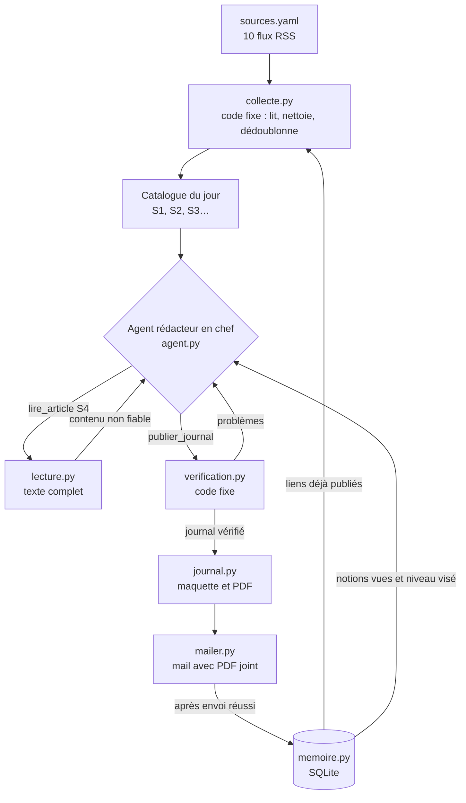

# Le Veilleur


Un agent IA qui lit chaque matin une dizaine de sources cyber et m'envoie un journal en PDF : un article de une développé, des brèves classées par rubrique, une notion à apprendre et un rappel des notions passées. Chaque information renvoie à sa source, et c'est du code, pas le modèle, qui le vérifie.

Le projet a deux objectifs. Me former au quotidien sur l'actualité technique, les fuites, la géopolitique et la régulation. Et montrer comment on construit un agent LLM qui reste fiable et sûr.

## Ce qu'est un agent, ici

Un LLM seul reçoit du texte et rend du texte. Un agent, c'est le même modèle placé dans une boucle avec des outils : il demande à utiliser un outil, le code l'exécute et lui renvoie le résultat, et il décide de la suite.

Le Veilleur ne donne de l'autonomie qu'à l'étape qui demande du jugement. La collecte est du code fixe. La rédaction est un agent, le rédacteur en chef. La vérification est du code fixe.

## Architecture



L'agent dispose de deux outils. `lire_article` lui donne le texte complet d'un article du catalogue. `publier_journal` lui sert à rendre le journal. Si la vérification échoue, l'outil lui renvoie la liste des problèmes et il peut corriger, deux fois au plus. Après, on ne garde que ce qui a passé le contrôle.

## La mémoire

Le modèle ne retient rien d'un appel à l'autre. Pendant une exécution, sa mémoire courte est l'historique de la conversation, que la boucle lui renvoie à chaque tour. D'un matin à l'autre, c'est une base SQLite dans `data/veilleur.db` qui prend le relais.

Elle garde les articles déjà publiés, les notions déjà expliquées avec leur niveau et leur idée clé, et les éditions. Elle sert à quatre moments. Avant l'agent, le code retire du catalogue tout article déjà publié. Au démarrage de l'agent, il reçoit la liste des notions vues et le niveau visé, qui monte d'un cran toutes les dix notions. À la vérification, une notion trop proche d'une notion déjà vue est refusée et l'agent doit en choisir une autre. À la mise en page, l'encadré Rappel reprend l'idée clé des notions d'il y a 1, 3 et 7 éditions : c'est le principe de la répétition espacée, qui fixe mieux une notion qu'un quiz isolé. Ces rappels sont lus en base par le code, sans appel au modèle.

Rien n'est mémorisé en mode `--dry-run`, ni si l'envoi du mail échoue. On ne stocke que des données validées par le code, jamais le texte des articles : sinon une injection cachée dans une page reviendrait dans le prompt tous les jours suivants.

`python -m veille.memoire` affiche ce que l'agent a retenu.

## Comment l'agent évite d'inventer

L'agent ne cite les sources que par identifiant, comme `S4`. Les liens sont ajoutés par le code à partir du flux, donc un lien inventé est impossible.

Avant publication, le code vérifie que chaque identifiant cité existe, que la une s'appuie sur au moins un article lu en entier et que chaque paragraphe de la une cite une source. Il vérifie aussi que chaque numéro de CVE et chaque grand nombre figurent dans les sources citées. Un « 4 500 000 victimes » absent de l'article est rejeté.

## Sécurité de l'agent

Le contenu des flux et des pages est traité comme une entrée non fiable, car n'importe qui peut écrire dans un article.

L'agent ne choisit jamais une URL. Il choisit un identifiant du catalogue, et le code visite le lien correspondant. Une page piégée ne peut donc pas le faire naviguer ailleurs. Le texte lu lui est rendu dans une balise `<contenu_non_fiable>`, et le prompt système précise que ce contenu n'est jamais une consigne.

Ses capacités sont bornées : deux outils, six lectures, dix tours, et une publication forcée au dernier tour. Les téléchargements ont un délai et une taille maximale. Le HTML est échappé avant la mise en page, les liens non `http` sont rejetés dès la collecte, et les secrets restent dans `.env`.

Chaque décision de l'agent est enregistrée dans `logs/trace-AAAA-MM-JJ.json` pour pouvoir relire son raisonnement.

## Installation

```bash
python -m venv .venv
source .venv/bin/activate          # sous Windows : .venv\Scripts\activate
pip install -r requirements.txt
playwright install chromium        # moteur utilisé pour produire le PDF
cp .env.example .env               # puis remplir la clé API et le compte mail
```

Pour Gmail, il faut un mot de passe d'application, le mot de passe du compte est refusé.

## Utilisation

```bash
python -m veille.main --dry-run    # produit le PDF dans out/ sans l'envoyer
python -m veille.main              # envoie le journal par mail
python -m veille.memoire           # affiche les notions vues et le niveau actuel
python -m pytest                   # 34 tests, sans réseau ni clé API
```

Pour ajouter une source, il suffit d'une entrée dans `sources.yaml`. Une source en panne est ignorée et signalée en bas du journal.

## Exécution automatique

L'agent ne tourne pas en continu. Il se lance chaque matin, travaille quelques minutes, envoie le journal et s'arrête.

### Dans le cloud, avec GitHub Actions

C'est le mode par défaut : aucun ordinateur n'a besoin d'être allumé. Le workflow `.github/workflows/veilleur.yml` se déclenche vers 6 h 30 l'été et 5 h 30 l'hiver, heure de Paris.

1. Pousser le dépôt sur GitHub.
2. Dans *Settings > Secrets and variables > Actions*, créer les secrets `ANTHROPIC_API_KEY`, `SMTP_USER`, `SMTP_PASSWORD` et `MAIL_TO`.
3. Dans l'onglet *Actions*, ouvrir *Le Veilleur* et cliquer sur *Run workflow* pour une première édition.

Chaque exécution démarre sur une machine vierge. Le script `scripts/memoire_git.sh` récupère donc la base SQLite depuis la branche `memoire` au début, et l'y repousse après un envoi réussi. Le PDF et la trace de l'agent restent téléchargeables deux semaines dans l'onglet *Actions*.

Le workflow `tests.yml` lance les tests à chaque push.

### Sur un PC Windows, en secours

```powershell
powershell -ExecutionPolicy Bypass -File scripts\installer_tache_windows.ps1
```

La tâche se lance à 7 h. Elle sort le PC de veille, et s'il était éteint, l'édition part dès l'allumage. Il ne faut pas activer les deux modes à la fois : on recevrait deux journaux, et chaque lanceur aurait sa propre mémoire.

## Feuille de route

- [x] Récap sourcé et vérifié d'une source, envoi par mail
- [x] Agent rédacteur en chef, dix sources, journal PDF
- [x] Mémoire SQLite des articles publiés, des notions vues et de la progression
- [ ] Notions sourcées par RAG sur les guides de l'ANSSI, progression de difficulté
- [x] Rappel espacé des notions à 1, 3 et 7 éditions
- [x] Exécution quotidienne sur GitHub Actions, mémoire persistée sur une branche
- [ ] Retour sur la notion du jour pour ajuster le niveau

Les choix techniques et leurs alternatives sont détaillés dans [DECISIONS.md](DECISIONS.md).
